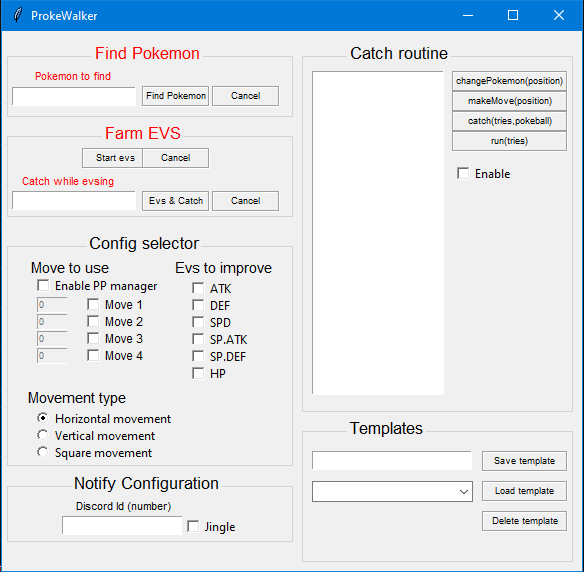

# ProkeWalker
The ProkeWalker is a bot made to assist trainers in optimizing their gameplay experience assisting the actions in the Pokemon Revolution Online universe that are repeated and become boring . This bot allowe trainers to find specific pokemon and train Evs and catch.
## Features
- Find Pokemon: run out from all pokemon exept the one you're looking for, it stop when he find the pokemon sending you notification

- Farm Evs: fight all the pokemon that drop the evs you want, using random moves or the one you insert

- Catch while evsing: fights with moves you selected or random moves against pokemon giving evs selected below, but stops if it encounters the pokemon written in the box sending you notification

- Catch rutine: with the catch rutine you can configurate your own steps of operations when you find a pokemon that you want to catch:
  - changePokemon(position), this will change pokemon with the one you chose from 1 to 6
  - makeMoves(position), this will chose the move the pokemon you have in comat will to from 1 to 4
  - catchTries(tries,pokebal), this will try to catch the pokemon fr "tries" times using the pokebal you choose depending the position if has in your bag
  - run(tries), this option will exape from the battle "tries" times, use this in case bot won't catch the pokemn after the tries you chose in the previous operation

*Notification
For get notify on Discord, jingle or both compile form in the notification section. Notify is starting if you find the pokemon you're looking for or if there is rare pokemon (shiny form)

## Important
- Be sure you always open before the game and then start the bot
- Edit discord weeb hook for get norify about catch in your prefered discord (constant.py)
- Chose your prefered jingle, if you want edit it in the folder sounds.

